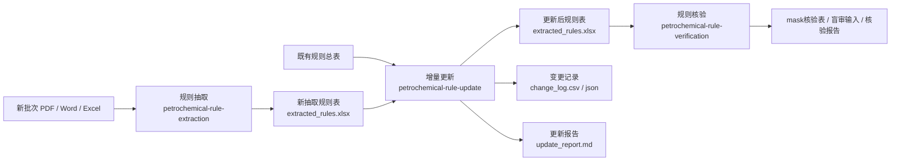
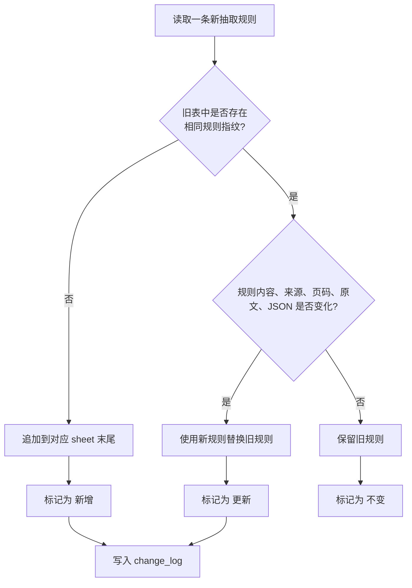
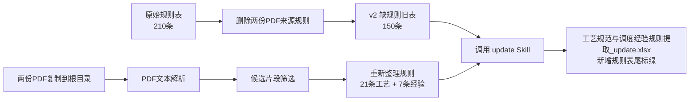
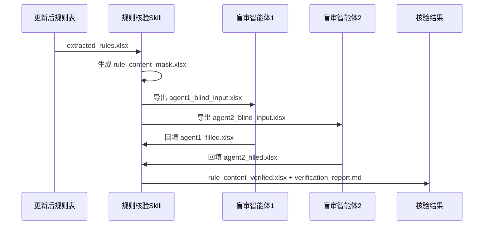

# 规则增量更新 Skill 模拟验证报告

更新时间：2026-05-27

## 1. 一页结论

本次验证的是一条完整的规则增量更新链路：

```text
旧规则表 -> 新文档重新抽取 -> 增量合并 -> 新增规则标识 -> 后续核验
```

模拟结果如下：

| 阶段                         | 工艺规范规则 | 调度经验规则 | 合计 |
| ---------------------------- | -----------: | -----------: | ---: |
| 原始规则总表 v1              |          120 |           90 |  210 |
| 删除两份 PDF 相关规则后的 v2 |           63 |           87 |  150 |
| 从两份 PDF 重新抽取          |           21 |            7 |   28 |
| 增量更新后 finish            |           84 |           94 |  178 |

结论：`petrochemical-rule-update` 可以把新抽取规则作为增量数据追加到旧规则表末尾，生成变更记录，并输出可继续进入规则核验流程的标准规则表。

## 2. 完整业务流程

生产使用时，三个 Skill 的关系如下：



该流程中：

| 环节     | 作用                                      | 是否属于本次模拟 |
| -------- | ----------------------------------------- | ---------------- |
| 规则抽取 | 从新 PDF/Word/Excel 中提取结构化规则      | 已模拟           |
| 增量更新 | 判断新增、更新、不变，并合并旧表          | 已执行           |
| 规则核验 | 对合并后的规则做 mask、盲审和人工核对判定 | 已执行           |

## 3. 增量更新逻辑

`petrochemical-rule-update` 默认使用以下字段判断是否为同一条规则：

```text
知识类型 + 子类型 + 适用范围 + 规则名称
```

判断逻辑如下：



本次模拟中，旧表 `工艺规范与调度经验规则提取_delete.xlsx` 已经删除了两份 PDF 来源的规则，因此从 PDF 重新抽取出的 28 条规则全部被判定为 `新增`，并追加到表尾。

## 4. 本次模拟设计



设计目的：

1. 验证旧表缺失规则时，新规则能否被识别为 `新增`。
2. 验证新增规则是否只追加到表尾，而不是恢复原来在 v1 中的位置。
3. 验证 `finish.xlsx` 是否只改变新增规则字体颜色，不改变原表格式。
4. 验证输出是否能继续作为核验 Skill 的输入。

## 5. 模拟输入

### 5.1 原始规则表

```text
/Applications/Desktop/项目/5.27/工艺规范与调度经验规则提取v1.xlsx
```

原始规模：

| Sheet                        | 数量 |
| ---------------------------- | ---: |
| `2、工艺规范规则（120条）` |  120 |
| `4、调度经验规则（90条）`  |   90 |

### 5.2 新批次 PDF

原始 PDF 位于：

```text
/Applications/Desktop/项目/5.27/shihua/延长数据/操作规程
```

本次复制到项目根目录，模拟新来文档：

```text
/Applications/Desktop/项目/5.27/榆炼-连续重整和苯抽取联合装置操作规程.pdf
/Applications/Desktop/项目/5.27/延炼-航煤加氢装置操作规程.pdf
```

## 6. 模拟步骤

### 6.1 生成缺规则旧表 v2

从 v1 中删除来源文件包含上述两份 PDF 的规则，生成：

```text
/Applications/Desktop/项目/5.27/v2.xlsx
```

删除结果：

| Sheet        | v1 原数量 | 删除数量 | v2 剩余数量 |
| ------------ | --------: | -------: | ----------: |
| 工艺规范规则 |       120 |       57 |          63 |
| 调度经验规则 |        90 |        3 |          87 |

### 6.2 从 PDF 重新抽取规则

本次重新解析 PDF 文本、筛选候选片段，并整理为规则表。

输出目录：

```text
/Applications/Desktop/项目/5.27/reextract_from_pdf_output
```

关键文件：

| 文件                              | 说明                 |
| --------------------------------- | -------------------- |
| `text/*.pages.jsonl`            | PDF 按页文本解析结果 |
| `candidates/*.candidates.jsonl` | 候选规则片段         |
| `extracted_rules.xlsx`          | 重新抽取规则表       |
| `reextracted_rules.csv`         | 重新抽取规则明细     |
| `reextract_report.md`           | 抽取统计             |

重新抽取结果：

| 类型       | 数量 |
| ---------- | ---: |
| 工艺规范类 |   21 |
| 调度经验类 |    7 |

说明：这 28 条规则来自 PDF 文本候选片段整理，不是从 v1 对应规则行切取。

### 6.3 调用增量更新 Skill

执行命令：

```bash
python ~/.codex/skills/petrochemical-rule-update/scripts/merge_rule_updates.py \
  --old /Applications/Desktop/项目/5.27/v2.xlsx \
  --new /Applications/Desktop/项目/5.27/reextract_from_pdf_output/extracted_rules.xlsx \
  --output-dir /Applications/Desktop/项目/5.27/update_from_reextract_output
```

输出目录：

```text
/Applications/Desktop/项目/5.27/update_from_reextract_output
```

关键文件：

| 文件                     | 说明                        |
| ------------------------ | --------------------------- |
| `updated_rules.xlsx`   | 增量更新后的规则表          |
| `extracted_rules.xlsx` | 给核验 Skill 使用的标准输入 |
| `change_log.csv`       | 新增/更新记录               |
| `change_log.json`      | 结构化变更记录              |
| `update_report.md`     | 更新统计报告                |

更新结果：

| Sheet      | 新增 | 更新后总数 |
| ---------- | ---: | ---------: |
| 工艺规范类 |   21 |         84 |
| 调度经验类 |    7 |         94 |
| 合计       |   28 |        178 |

## 7. finish.xlsx 结果

最终交付表：

```text
/Applications/Desktop/项目/5.27/finish.xlsx
```

生成规则：

- 数据内容来自 `update_from_reextract_output/extracted_rules.xlsx`
- 表格格式参考 `工艺规范与调度经验规则提取v1.xlsx`
- 新增规则只追加在对应 sheet 末尾
- 只将新增规则字体设置为绿色
- 不额外修改填充、边框、列宽、对齐等格式

验证结果：

| Sheet        | v2 原有规则 | finish 总数 | 新增规则位置 | 是否连续表尾追加 |
| ------------ | ----------: | ----------: | ------------ | ---------------- |
| 工艺规范规则 |          63 |          84 | 第 65-85 行  | 是               |
| 调度经验规则 |          87 |          94 | 第 89-95 行  | 是               |

## 8. 后续核验流程

本次未执行核验，但已经形成核验输入。后续可继续调用 `petrochemical-rule-verification`：

```bash
python ~/.codex/skills/petrochemical-rule-verification/scripts/run_verification.py \
  --phase prep \
  --input /Applications/Desktop/项目/5.27/update_from_reextract_output/extracted_rules.xlsx \
  --output-dir /Applications/Desktop/项目/5.27/verification_from_reextract_output
```

核验流程如下：



核验关注点：

| 核验对象          | 作用                                           |
| ----------------- | ---------------------------------------------- |
| `规则内容mask1` | 核对数值、阈值、范围、单位                     |
| `规则内容mask2` | 核对动作、对象、工况、运行模式                 |
| `人工核对`      | 标出证据缺失、数值冲突、语义不一致等高风险规则 |

## 9. 中间文件

本次模拟保留全部中间文件：

```text
/Applications/Desktop/项目/5.27/v2.xlsx
/Applications/Desktop/项目/5.27/reextract_from_pdf_output/
/Applications/Desktop/项目/5.27/update_from_reextract_output/
/Applications/Desktop/项目/5.27/finish.xlsx
```

早期试验文件也保留，用于追溯错误模拟和修正过程：

```text
/Applications/Desktop/项目/5.27/新批次两文件抽取结果.xlsx
/Applications/Desktop/项目/5.27/update_simulation_output/
/Applications/Desktop/项目/5.27/update_simulation_output_style_fixed/
/Applications/Desktop/项目/5.27/finish_wrong_v1_content_order.xlsx
/Applications/Desktop/项目/5.27/finish_before_pdf_reextract.xlsx
```

## 10. 当前边界

已验证：

- 旧规则表可以构造为缺规则版本 `v2.xlsx`
- 新 PDF 可以重新解析并抽取规则
- update Skill 可以自动识别新增并追加到表尾
- `finish.xlsx` 可以只标绿新增规则，保持原表格式
- 更新后结果可以继续交给核验 Skill

需要说明：

- 本次 PDF 重新抽取采用高置信规则抽取，没有追求全量恢复 v1 删除的 60 条规则。
- 核验流程本次只写入方案与命令，未执行盲审回填和最终判定。
- 后续真实项目中，新增和更新规则仍建议通过核验 Skill 输出人工复核清单。

## 11. 汇报口径

```text
本次完成了规则增量更新 Skill 的模拟验证。我们先从既有规则总表中删除两份操作规程对应的规则，形成缺规则旧表；再将两份 PDF 作为新批次文档，从 PDF 文本中重新抽取规则；随后调用增量更新 Skill，将未在旧表中出现的新规则自动追加到对应规则表末尾，并生成变更记录和更新报告。最终 finish.xlsx 中新增规则以绿色字体标识，原表格式保持一致。该结果可继续输入规则核验 Skill，完成 mask、盲审回填和人工核对判定。
```
