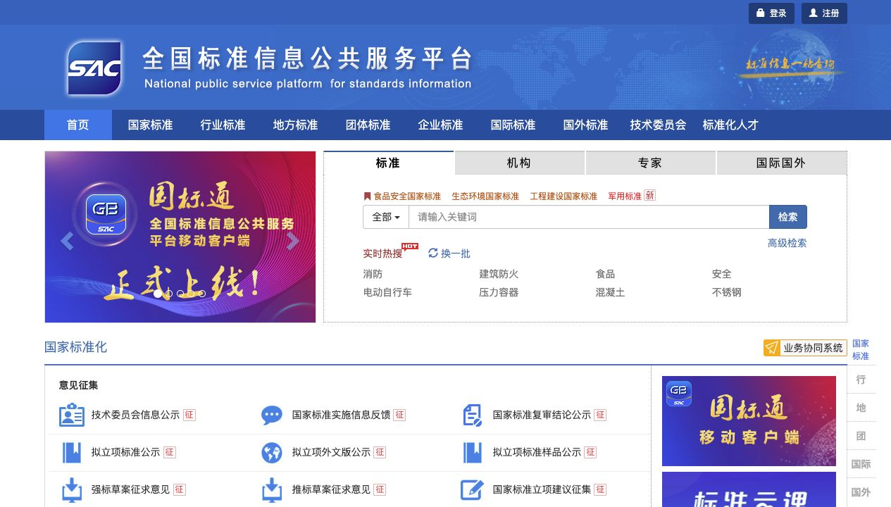
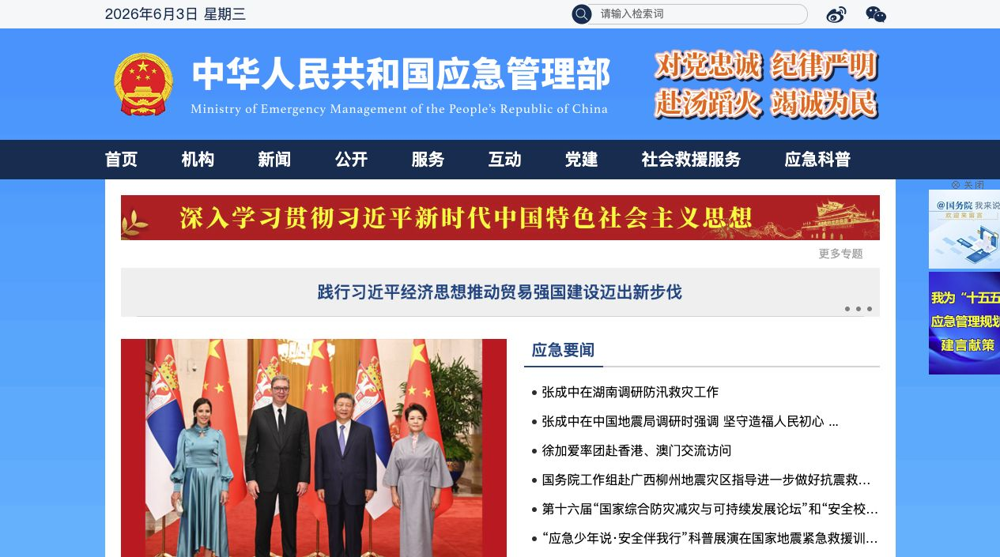

# 通用知识规则标准来源记录

记录时间：2026-06-02 14:05 CST

最近更新：2026-06-03（补充推荐网站链接与首页截图）

来源：国家标准和行业标准检索结果截图（用户提供）

## 推荐检索网站与截图

以下网站为本周通用规则资料搜集和后续扩展的检索入口。截图用于展示调研路径和工作量；规则抽取、核验和人工二审仍以已下载的现行标准原文或正式监管文件为准。

| 网站 | 链接 | 用途 | 首页截图 |
| --- | --- | --- | --- |
| 国家标准全文公开系统 | [https://openstd.samr.gov.cn/bzgk/gb/](https://openstd.samr.gov.cn/bzgk/gb/) | 查看和下载现行国家标准全文，适合核对强制性、推荐性国家标准原文。 |  |
| 全国标准信息公共服务平台 | [https://std.samr.gov.cn/](https://std.samr.gov.cn/) | 统一检索国家标准、行业标准、地方标准、团体标准、企业标准和国际国外标准。 |  |
| 行业标准信息服务平台 | [https://hbba.sacinfo.org.cn/](https://hbba.sacinfo.org.cn/) | 检索行业标准备案信息和月报，适合后续扩展 AQ、SH、HG、JT 等行业标准来源。 |  |
| 中华人民共和国应急管理部 | [https://www.mem.gov.cn/](https://www.mem.gov.cn/) | 检索安全生产、危险化学品、应急管理、专项整治和政策文件。 |  |
| 中华人民共和国生态环境部 | [https://www.mee.gov.cn/](https://www.mee.gov.cn/) | 检索生态环境、污染物排放、排污许可、温室气体和碳排放相关监管资料。 |  |

## 已下载

| 序号 | 标准号 | 标准名称 | 类别 | 状态 | 发布日期 | 实施日期 | 备注 |
| --- | --- | --- | --- | --- | --- | --- | --- |
| 1 | GB/T 32151.15-2023 | 碳排放核算与报告要求 第15部分：石油化工企业 | 推荐性 | 现行 | 2023-12-28 | 2024-07-01 | 已下载；文件路径：`/Users/machong/shihua-project/石化通用规则源文件/GBT+32151.15-2023.pdf` |
| 2 | GB 16994.2-2021 | 港口作业安全要求 第2部分：石油化工库区 | 强制性 | 现行 | 2021-12-01 | 2022-12-01 | 已下载；文件路径：`/Users/machong/shihua-project/石化通用规则源文件/GB+16994.2-2021.pdf` |
| 6 | AQ/T 3005-2006 | 石油化工建设项目管理方安全管理实施导则 | 推荐性行业标准 | 已废止，2024-07-01 废止 | 2006-11-02 | 2006-12-01 | 已下载；扫描版；本轮不参考；文件路径：`/Users/machong/shihua-project/石化通用规则源文件/废止不参考/P020190327401582013711_AQT-3005-2006_已废止不参考.pdf` |

## 待下载或待评估

| 序号 | 标准号 | 标准名称 | 类别 | 状态 | 发布日期 | 实施日期 | 备注 |
| --- | --- | --- | --- | --- | --- | --- | --- |
| 3 | GB/T 23524-2019 | 石油化工废铂催化剂化学分析方法 铂含量的测定 ... | 推荐性 | 现行 | 2019-06-04 | 2020-05-01 | 偏分析方法，是否适合通用知识规则需评估 |
| 4 | GB/T 32039-2015 | 石油化工企业节能项目经济评价方法 | 推荐性 | 现行 | 2015-09-11 | 2016-04-01 | 可用于节能、经济评价类通用规则 |
| 5 | GB/T 2013-2010 | 液体石油化工产品密度测定法 | 推荐性 | 现行 | 2011-01-10 | 2011-05-01 | 可用于检测/质量分析类通用规则 |

## 当前用途判断

- `GB/T 32151.15-...`：适合抽取碳排放核算、报告边界、核算口径、排放因子使用等通用规则。
- `GB 16994.2-2021`：适合抽取石油化工库区港口作业、安全操作、装卸、储运、应急要求等通用规则。
- `AQ/T 3005-2006`：已废止，本轮不作为规则来源，也不作为框架参考。
- 第 3 条偏实验/检测方法，建议暂列为低优先级，除非知识库需要覆盖废催化剂检测规则。
- 第 4 条适合补充节能项目评价规则，但和当前工艺/安全/知识库主线相比优先级中等。
- 第 5 条适合补充产品密度检测方法类规则，可作为质量检测规则来源。

## 2026-06-02 初步可提取性评估

| 文件 | 可提取性 | 通用规则价值 | 技术处理建议 |
| --- | --- | --- | --- |
| `GBT+32151.15-2023.pdf` | 高 | 高。适合碳排放核算边界、计量监检测、核算方法、数据质量、报告格式类规则。 | PDF 可直接抽取文本，可优先批量抽取。 |
| `GB+16994.2-2021.pdf` | 中高 | 高。适合港口石油化工库区装卸、储运、安全标识、静电、防火、特殊作业等规则。 | PDF 常规文本抽取出现编码乱码，建议 OCR 或换解析工具；可先人工选条款试抽。 |
| `P020190327401582013711_AQT-3005-2006_已废止不参考.pdf` | 不纳入 | 不纳入。本轮只使用现行文件。 | 不投入 OCR，不参与本周通用规则抽取。 |

## 下一步

1. 优先从 `GB/T 32151.15-2023` 抽取 10-15 条碳排放核算/报告类规则。
2. 再从 `GB 16994.2-2021` 抽取 10-15 条库区作业安全类规则，先解决 OCR 或文本解析问题。
3. `AQ/T 3005-2006` 本轮不参考；后续如需建设项目安全管理类规则，应另找现行标准或现行指南。
