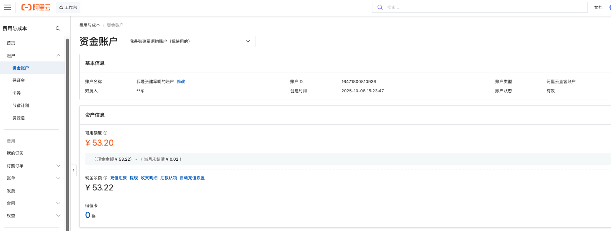

# 医疗 Demo 花销账单

账单日期：2026-07-01
项目名称：医疗资源推荐 Demo
费用用途：云服务器部署、模型 API Token 调用

## 费用汇总

| 序号 | 费用项目       | 服务内容                       | 规格/说明                                                                       |    金额 |
| ---- | -------------- | ------------------------------ | ------------------------------------------------------------------------------- | ------: |
| 1    | 云服务器费用   | 阿里云轻量应用服务器           | 2 vCPU / 4 GiB 内存 / 50 GiB 系统盘 / Ubuntu 24.04 / 上海地域 / 1 IPv4 / 1 个月 | ¥29.00 |
| 2    | API Token 费用 | 阿里云百炼 / Qwen API 调用账户 | 用于病历 OCR、结构化解析、医疗资源推荐、AI 医疗助手等模型调用                   |  ¥50.0 |

**费用合计：¥79.0**

## 费用说明

- 云服务器订单原价为 ¥70.00，优惠 ¥41.00，实际支付 ¥29.00。
- 云服务器服务周期为 2026-07-01 16:58:11 至 2026-08-02 00:00:00。
- API Token 费用账户可用额度 ¥50.0 计入本次 Demo 预算。

## 凭证截图

### 云服务器订单

### API Token 费用

