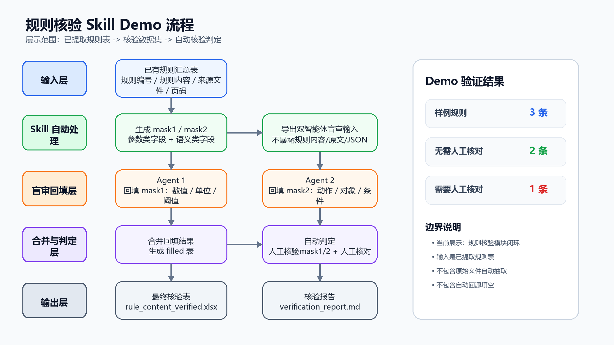
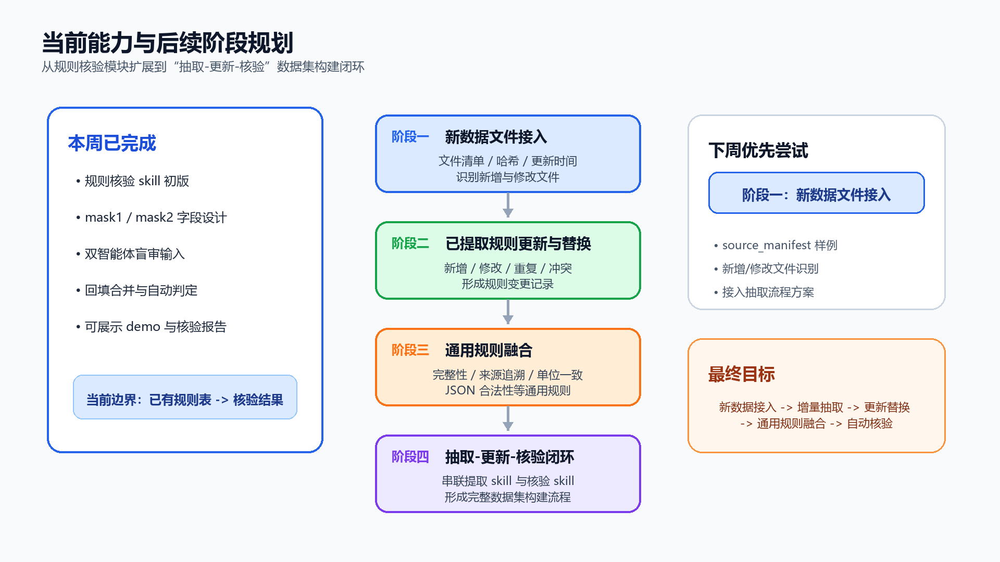

更新时间：2026-05-20

## 1. 本周进展

- 规则核验 skill 初版完成。
- Demo 链路：已提取规则表 -> 核验报告。
- Demo 结果：`3` 条规则，`2` 条无需人工核对，`1` 条需要人工核对。
## 2. 本周产出

| 产出       | 文件/目录                                                                                            |
| -------- | ------------------------------------------------------------------------------------------------ |
| Skill 文档 | `skill documents/petrochemical-rule-verification/SKILL.md`                                       |
| 核验脚本     | `build_mask_workbook.py`、`export_blind_inputs.py`、`merge_agent_fills.py`、`judge_verification.py` |
| Demo 样例  | `rule_verification_skill_demo/`                                                                  |
| Demo 整理表 | `09_demo_clean_data.xlsx`、`09_demo_clean_data.md`                                                |

## 3. Demo 数据展示



```
已提取规则表 -> mask 核验表 -> 双智能体盲审输入 -> 回填结果合并 -> 自动核验判定 -> 核验报告
```

### 3.1 Demo 结果概览

文件路径:`./rule_verification_skill_demo/08_verification_report.md`、`./rule_verification_skill_demo/09_demo_clean_data.xlsx`

| Demo 输入 | Demo 输出 | 核验结果 | 重点问题 |
|---|---|---|---|
| **3 条已提取规则** | 核验表、核验报告 | **2 条无需人工核对，1 条需要人工核对** | **R1-003 参数类字段：100% -> 45%** |

### 3.2 输入规则

文件路径:`./rule_verification_skill_demo/01_rule_content_mask.xlsx`

| 规则编号 | 规则名称 | 已提取规则内容 |
|---|---|---|
| R1-001 | 跨装置负荷调整报批规则 | 当装置负荷波动**超过10%**或调整将影响其他单位时，应先履行告知/请示程序后再实施负荷调整。 |
| R1-002 | 常压停工降量速率规则 | 常压装置停工时按**20 t/h**开始降量，不宜一次性大幅降量。 |
| **R1-003** | **常压切换分步引料规则** | 加热炉反应进料或原油切换时，按25%、50%、75%、**100%**四步逐级引入设计负荷，每步确认温度平稳后再升下一档。 |

### 3.3 mask 拆分

文件路径:`./rule_verification_skill_demo/01_rule_content_mask.xlsx`

参数类 mask：

| 规则编号       | 参数类 mask                                                  | 参数关键字段     |
| ---------- | --------------------------------------------------------- | ---------- |
| R1-001     | 当装置负荷波动____或调整将影响其他单位时，应先履行告知/请示程序后再实施负荷调整。               | **超过10%**  |
| R1-002     | 常压装置停工时按____开始降量，不宜一次性大幅降量。                               | **20 t/h** |
| **R1-003** | 加热炉反应进料或原油切换时，按25%、50%、75%、____四步逐级引入设计负荷，每步确认温度平稳后再升下一档。 | **100%**   |

语义类 mask：

| 规则编号 | 语义类 mask | 语义关键字段 |
|---|---|---|
| R1-001 | 当装置负荷波动超过10%或调整将影响其他单位时，应先履行____后再实施负荷调整。 | **告知/请示程序** |
| R1-002 | 常压装置____时按20 t/h开始降量，不宜一次性大幅降量。 | **停工** |
| **R1-003** | 加热炉反应进料或原油____时，按25%、50%、75%、100%四步逐级引入设计负荷，每步确认温度平稳后再升下一档。 | **切换** |

### 3.4 回填核验

文件路径:`./rule_verification_skill_demo/06_rule_content_filled.xlsx`、`./rule_verification_skill_demo/07_rule_content_verified.xlsx`

| 规则编号 | 核验对象 | 关键字段 | 回填内容 | 自动判定 |
|---|---|---|---|---|
| R1-001 | 参数类字段 | 超过10% | 10% | 通过 |
| R1-001 | 语义类字段 | 告知/请示程序 | 告知/请示程序 | 通过 |
| R1-002 | 参数类字段 | 20 t/h | 20 t/h | 通过 |
| R1-002 | 语义类字段 | 停工 | 停工 | 通过 |
| **R1-003** | **参数类字段** | **100%** | **45%** | **需人工复核** |
| R1-003 | 语义类字段 | 切换 | 切换 | 通过 |

### 3.5 最终输出

文件路径:`./rule_verification_skill_demo/07_rule_content_verified.xlsx`、`./rule_verification_skill_demo/08_verification_report.md`

| 规则编号       | 规则名称           | 最终核对       | 问题定位                            |
| ---------- | -------------- | ---------- | ------------------------------- |
| R1-001     | 跨装置负荷调整报批规则    | 无需人工核对     | 无                               |
| R1-002     | 常压停工降量速率规则     | 无需人工核对     | 无                               |
| **R1-003** | **常压切换分步引料规则** | **需要人工核对** | **参数类字段不一致：关键字段=100%；回填内容=45%** |

### 3.6 来源依据

文件路径:`./rule_verification_skill_demo/07_rule_content_verified.xlsx`

| 规则编号 | 来源文件 | 具体页码 | 原文依据 |
|---|---|---|---|
| R1-001 | 集团公司生产调度管理规定（终）.doc | 第18、19、20条 | 生产运行调整影响其他单位时需履行告知义务；装置负荷波动超过10%。 |
| R1-002 | 延炼-300万吨常压蒸馏装置操作规程.pdf | 停工进度安排页 | 第一天0:00开始以20t/h降量。 |
| R1-003 | 延炼-航煤加氢装置操作规程.pdf | 第75页 | 按照25%、50%、75%、100%分四步引设计原料入滤前原料油缓冲罐。 |

## 4. 当前能力边界

| 已支持                  | 尚未支持                    |
| -------------------- | ----------------------- |
| 基于已有规则表构建核验数据集       | 新数据文件自动接入               |
| 自动生成 `mask1 / mask2` | 已提取规则的更新与替换             |
| 导出双智能体盲审输入           | 通用规则库设计与融合              |
| 合并回填结果并自动判定          | 抽取 skill 与核验 skill 一键串联 |

## 5. 阶段拆解



## 6. 下周计划

阶段一：新数据文件接入。

- `source_manifest` 文件清单样例；
- 文件路径、类型、大小、哈希、更新时间等元数据记录；
- 新增文件与已有文件识别逻辑；
- 新文件接入规则抽取流程初步方案。

找一些推荐书籍
规则库分类：通用规则；适用于不同提炼的规则；