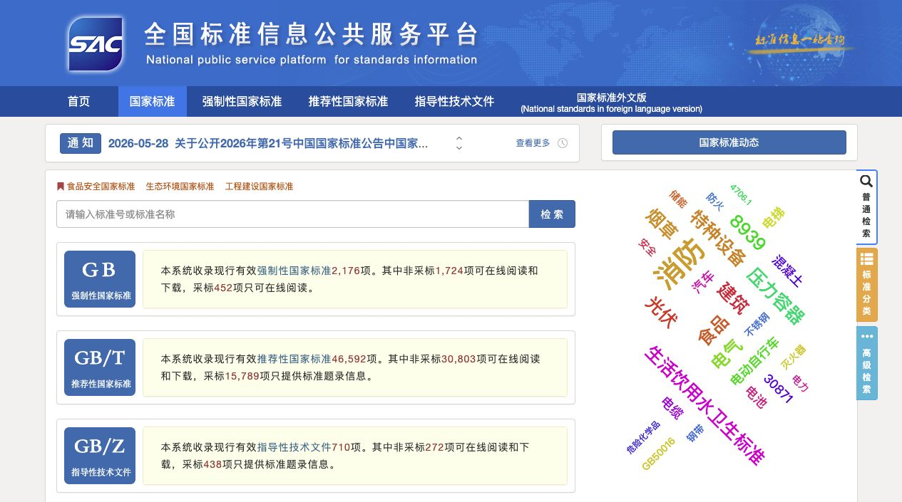
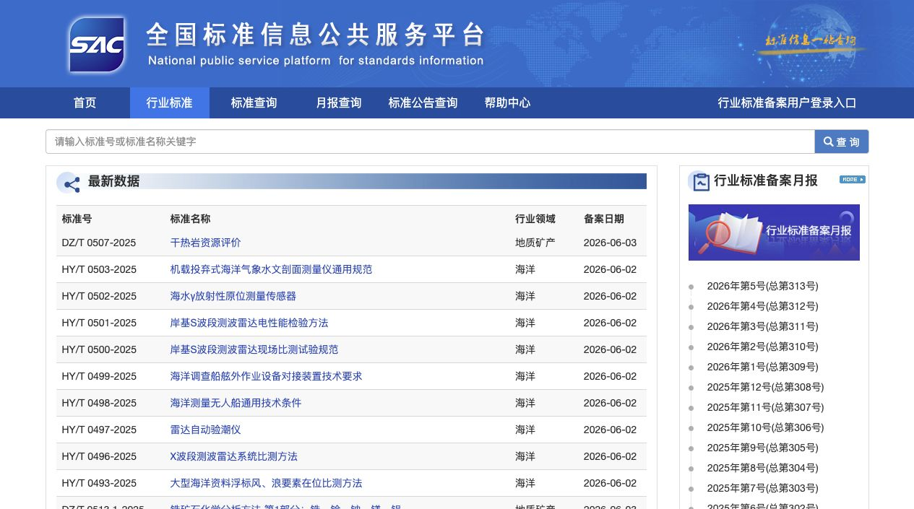
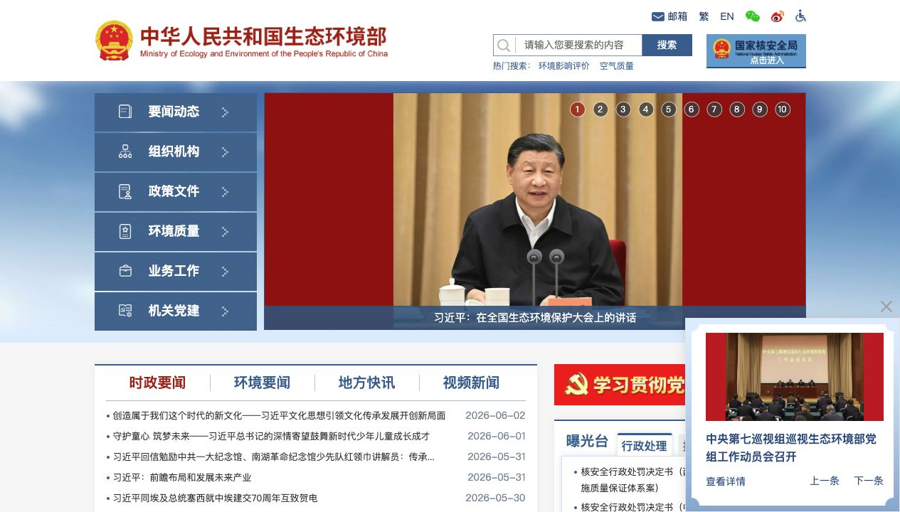

# 推荐网站链接与截图记录

记录日期：2026-06-03

本文件用于补充本周周报的资料搜集过程证据。这里记录的是检索入口、筛选渠道和工作路径，不直接作为规则原文依据；规则抽取仍以已下载的现行标准或正式文件原文为准。

## 检索入口汇总

| 网站 | 链接 | 适用资料类型 | 本周用途 | 首页截图 |
| --- | --- | --- | --- | --- |
| 国家标准全文公开系统 | [https://openstd.samr.gov.cn/bzgk/gb/](https://openstd.samr.gov.cn/bzgk/gb/) | 查看和下载现行国家标准全文，适合核对强制性、推荐性国家标准原文。 | 本周用于支撑 GB/T 32151.15-2023 与 GB 16994.2-2021 这类国家标准来源的检索说明。 |  |
| 全国标准信息公共服务平台 | [https://std.samr.gov.cn/](https://std.samr.gov.cn/) | 统一检索国家标准、行业标准、地方标准、团体标准、企业标准和国际国外标准。 | 本周用于核对标准状态、发布日期、实施日期和标准类别。 |  |
| 行业标准信息服务平台 | [https://hbba.sacinfo.org.cn/](https://hbba.sacinfo.org.cn/) | 检索行业标准备案信息和月报，适合后续扩展 AQ、SH、HG、JT 等行业标准来源。 | 本周作为行业标准补充入口记录，后续用于寻找现行有效的石化、安全、环保类行业标准。 |  |
| 中华人民共和国应急管理部 | [https://www.mem.gov.cn/](https://www.mem.gov.cn/) | 检索安全生产、危险化学品、应急管理、专项整治和政策文件。 | 本周已做初步检索，暂未找到比现行国家标准更适合直接抽取通用规则的文件，后续继续跟踪。 |  |
| 中华人民共和国生态环境部 | [https://www.mee.gov.cn/](https://www.mee.gov.cn/) | 检索生态环境、污染物排放、排污许可、温室气体和碳排放相关监管资料。 | 本周已做初步检索，暂未找到可直接作为规则源文件的材料，后续可围绕排污许可和碳排放继续细化。 |  |

## 截图展示

### 国家标准全文公开系统

链接：[https://openstd.samr.gov.cn/bzgk/gb/](https://openstd.samr.gov.cn/bzgk/gb/)

### 全国标准信息公共服务平台

链接：[https://std.samr.gov.cn/](https://std.samr.gov.cn/)

### 行业标准信息服务平台

链接：[https://hbba.sacinfo.org.cn/](https://hbba.sacinfo.org.cn/)

### 中华人民共和国应急管理部

链接：[https://www.mem.gov.cn/](https://www.mem.gov.cn/)

### 中华人民共和国生态环境部

链接：[https://www.mee.gov.cn/](https://www.mee.gov.cn/)

